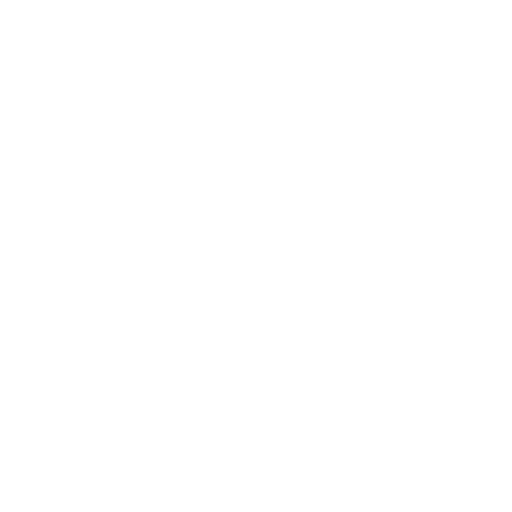

# 个人网站

```
<!--
//                       _oo0oo_
//                      o8888888o
//                      88" . "88
//                      (| -_- |)
//                      0\  =  /0
//                    ___/`---'\___
//                  .' \\|     |// '.
//                 / \\|||  :  |||// \
//                / _||||| -:- |||||- \
//               |   | \\\  - /// |   |
//               | \_|  ''\---/''  |_/ |
//               \  .-\__  '-'  ___/-. /
//             ___'. .'  /--.--\  `. .'___
//          ."" '<  `.___\_<|>_/___.' >' "".
//         | | :  `- \`.;`\ _ /`;.`/ - ` : | |
//         \  \ `_.   \_ __\ /__ _/   .-` /  /
//     =====`-.____`.___ \_____/___.-`___.-'=====
//                       `=---='
//
//
//     ~~~~~~~~~~~~~~~~~~~~~~~~~~~~~~~~~~~~~~~~~~~
//
//           佛祖保佑       永不宕机     永无BUG 
-->
<!DOCTYPE html>
<html>
	<head>
		<meta charset="utf-8">
		<meta name="viewport" content="width=device-width, initial-scale=1">
		<title>赵林阳</title>
		<link rel="stylesheet" href="css/css.css"/>
		<style>
			@font-face
			{
				font-family: 平方塞北体;
				src: url('平方塞北体.ttf'); 
			}
			
			.logo img{
				margin:0px 0% 0px 5%;
				width: 30%;
				height: 30%;
				border-radius: 50%;
				animation:fadenum 4s;
				
				}
				@keyframes fadenum{
				  0%{transform:translateX(200%);}
			}
			.bg{
				background-color: #ffffff; /* 浏览器不支持时显示 */
				background-image: linear-gradient(#aaff00, #fff);
			}
			
			.text2{
				background-color: #aaff00; /* 不支持线性的时候显示 */
				background-image: linear-gradient(to right, #0f0 , #f00 , #ff0 , #fff , #000);
			}
			
			.text2 h3{
				color: #fff;
				font-size: 20px;
			}
			
			.text2 p{
				
				font-size: 20px;
			}
			
			.religion{
				text-align: center;
				font-family: 平方塞北体;
				width: 30%;
				font-size: 50px;
				color: #00ff00;
				text-shadow: 5px 10px 15px #ffff00;
			}
			
			.Buddhism{
				width: 45%;
				background: #ffff00;
				margin:10px 10px 10px 10px;
				border-radius: 20px;
			    box-shadow:2px 6px 30px #55ff00;
				
			}
			
			.Taoism{
				width: 45%;
				background-image: linear-gradient(#fff, #000);
				margin:10px 0px 10px 0px;
				border-radius: 20px;
				box-shadow:2px 6px 30px #000;
			}
			
			.qq{
				text-align: center;
				background-color: #55aaff;
			}
			
			.qqh1{
				text-align: center;
				border: #55aaff;
				border-style: double;
				padding: 6px 0px 4px 1px;
				margin: 1px 0px 6px 1px;
				border-radius: 10px;
			}
			
			.qqimg{
				width: 50px;
			}
			
			.vk{
				text-align: center;
				background-color: #55aaff;
			}
			
			.vkh1{
				text-align: center;
				border: #55aaff;
				border-style: double;
				padding: 6px 0px 4px 1px;
				margin: 1px 0px 6px 1px;
				border-radius: 10px;
			}
			
			.vkimg{
				width: 50px;
			}
			
			.github{
				text-align: center;
				background-color: #000000;
			}
			
			.githubh1{
				text-align: center;
				border: #000000;
				border-style: double;
				padding: 6px 0px 4px 1px;
				margin: 1px 0px 6px 1px;
				border-radius: 10px;
				
			}
			
			.phone{
				text-align: center;
				background-color: #4ce670;
			}
			
			.phoneh1{
				font-size: 25px;
				text-align: center;
				border: #4ce670;
				border-style: double;
				padding: 6px 0px 4px 1px;
				margin: 1px 0px 6px 1px;
				border-radius: 10px;
			}
			
			.phoneimg{
				width: 50px;
			}
			
			.mail{
				text-align: center;
				background-color: #ffaa00;
			}
			
			.mailh1{
				font-size: 25px;
				text-align: center;
				border: #ffaa00;
				border-style: double;
				padding: 6px 0px 4px 1px;
				margin: 1px 0px 6px 1px;
				border-radius: 10px;
			}
			
			.mailimg{
				width: 50px;
			}
			
			.globe{
				text-align: center;
				background-color: #55aaff;
			}
			
			.globeimg{
				width: 50px;
			}
			
			.githubimg{
				width: 50px;
			}
			
			
			.address{
				background-image: url('../images/address.png');
				background-size: 100%;
				padding: 20px;
				background-position:center center;
			}
			
			.address1{
				width:50px;
				height:50px;
			}
			
			.address2{
			text-align: center;
			}
		</style>
	</head>


	<body>
		<table border="1" width="100%">
			<tr class="bg">
				<td colspan="2">
					<div class="logo"></div></td>
			</tr>
			<tr>
				<td class="text2" colspan="2"><h3>我的信息：</h3></td>
			</tr>
			<tr height="80">
				<td class="religion">信仰</td>
				<td>
					
				</td>
			</tr>
			<tr height="80">
				<td class="qq"></td>
				<td>
					<a target="_blank" href="tencent://message/?uin=2239632396"><h1 class="qqh1">2239632396</h1></a>
				</td>
			</tr>
			<tr height="80">
				<td class="vk"></td>
				<td>
					<a target="_blank" href="https://vk.com/zhaolinyang"><h1 class="vkh1">zhaolinyang</h1></a>
				</td>
			</tr>
			<tr height="80">
				<td class="github"></td>
				<td>
					<a target="_blank" href="https://github.com/laddzhao"><h1 class="githubh1">zhaolinyang</h1></a>
				</td>
			</tr>
			<tr height="80">
				<td class="phone"></td>
				<td>
					<a target="_blank" href="#"><h1 class="phoneh1">+86&nbsp;15184218238</h1></a>
				</td>
			</tr>
			<tr height="80">
				<td class="mail"></td>
				<td>
					<a target="_blank" href="mailto:2239632396@qq.com"><h1 class="mailh1">2239632396@qq.com</h1></a>
				</td>
			</tr>
			<tr height="80">
				<td class="globe"></td>
				<td class="address"><a target="_blank" href="https://surl.amap.com/LLEXzEt2Wy"><p class="address2"></p></a></td>
			</tr>
		</table>
	</body>
</html>
```
